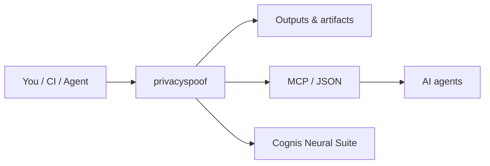

# privacyspoof — browser privacy hardening, blocklists & spoofing kit

> Part of the **[Cognis Neural Suite](https://github.com/cognis-digital)** · COCL v1.0 · domain: `privacy`

Curated **AdGuard/uBlock filter lists**, **tracker/cookie** controls, and **user-agent**,
**geolocation**, **timezone**, and **session** spoofing presets — with a **browser compatibility
matrix** so you know exactly what works where.

> ⚠️ **Authorized & lawful use only.** Spoofing is for privacy, testing, and research. Some sites'
> ToS prohibit it; you are responsible for how you use this.

<!-- cognis:layman:start -->
## What is this?

privacyspoof is a toolkit that helps you browse the web with less tracking. It gives you ready-to-use filter lists to block ads and trackers in your browser, plus presets for faking your location, timezone, and browser identity so websites see a generic profile instead of your real one. You run a simple command to pick a browser fingerprint or fake city, and it prints the settings you need. It is designed for privacy researchers, developers who need to test geo-specific content, and anyone who wants practical, copy-paste browser hardening without needing to understand every technical detail.
<!-- cognis:layman:end -->

## Contents

| Path | What |
|---|---|
| `filters/adguard-base.txt` | AdGuard/uBlock-syntax base blocklist |
| `filters/trackers.txt` | analytics/tracker domains |
| `filters/cookies-annoyances.txt` | cookie-banner / annoyance cosmetic rules |
| `spoof/user-agents.json` | UA strings + compatibility notes |
| `spoof/geolocation.json` | lat/lon/timezone presets |
| `spoof/sessions.md` | session/cookie isolation playbook |
| `COMPATIBILITY.md` | browser support matrix per technique |
| `privacyspoof.py` | CLI: pick a UA / geo, emit configs |

<!-- cognis:install:start -->
## Install

`privacyspoof` is source-available (not published to PyPI) — every method below installs
straight from GitHub. Pick whichever you prefer; the one-line scripts auto-detect
the best tool available on your machine.

**One-liner (Linux / macOS):**
```sh
curl -fsSL https://raw.githubusercontent.com/cognis-digital/privacyspoof/HEAD/install.sh | sh
```

**One-liner (Windows PowerShell):**
```powershell
irm https://raw.githubusercontent.com/cognis-digital/privacyspoof/HEAD/install.ps1 | iex
```

**Or install manually — any one of:**
```sh
pipx install "git+https://github.com/cognis-digital/privacyspoof.git"     # isolated (recommended)
uv tool install "git+https://github.com/cognis-digital/privacyspoof.git"  # uv
pip install "git+https://github.com/cognis-digital/privacyspoof.git"      # pip
```

**From source:**
```sh
git clone https://github.com/cognis-digital/privacyspoof.git
cd privacyspoof && pip install .
```

Then run:
```sh
python -m privacyspoof --help
```
<!-- cognis:install:end -->

## Quick start

```bash
python privacyspoof.py ua --os windows --browser chrome
python privacyspoof.py geo --city tokyo
python privacyspoof.py filters --format ublock > my-filters.txt
```

## Importing the filter lists

- **uBlock Origin:** Dashboard → Filter lists → Import → paste the raw URL of `filters/*.txt`.
- **AdGuard:** Settings → Filters → Custom → Add → raw URL.

See `COMPATIBILITY.md` before enabling spoofing — fingerprint-consistency matters (a Windows UA
with a macOS platform string is *more* identifying, not less).

## How it fits



**Explore the suite →** [🗂️ all tools](https://github.com/cognis-digital/cognis-neural-suite) · [⭐ awesome-cognis](https://github.com/cognis-digital/awesome-cognis) · [🔗 cognis-sources](https://github.com/cognis-digital/cognis-sources)

<a name="verification"></a>
## Verification


Every push is verified end-to-end. Latest audit (2026-06-13):

```text
tests        : 0 passed, 0 failed, 0 errored
compile      : all modules parse
cli          : n/a
package      : n/a
```

<details><summary>CLI surface (<code>--help</code>)</summary>

```text
(see --help)
```
</details>

Full machine-readable results: [`AUDIT.md`](AUDIT.md) · regenerate with `python -m privacyspoof --help` + `pytest -q`.

<div align="right"><a href="#top">↑ back to top</a></div>

