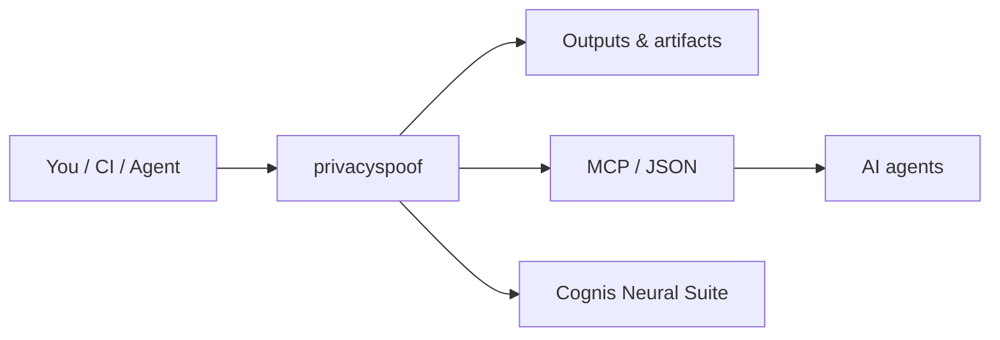

# privacyspoof — browser privacy hardening, blocklists & spoofing kit

> Part of the **[Cognis Neural Suite](https://github.com/cognis-digital)** · COCL v1.0 · domain: `privacy`

Curated **AdGuard/uBlock filter lists**, **tracker/cookie** controls, and **user-agent**,
**geolocation**, **timezone**, and **session** spoofing presets — with a **browser compatibility
matrix** so you know exactly what works where.

> ⚠️ **Authorized & lawful use only.** Spoofing is for privacy, testing, and research. Some sites'
> ToS prohibit it; you are responsible for how you use this.

## Usage — step by step

1. Get the kit — clone it (the CLI is a single stdlib script, `privacyspoof.py`):
   ```bash
   git clone https://github.com/cognis-digital/privacyspoof.git && cd privacyspoof
   ```
2. Emit a realistic user-agent for a target OS/browser:
   ```bash
   python privacyspoof.py ua --os windows --browser chrome
   ```
3. Pick a geolocation/timezone preset (defaults to `new_york`):
   ```bash
   python privacyspoof.py geo --city tokyo
   ```
4. Generate a blocklist in your ad-blocker's syntax and save it:
   ```bash
   python privacyspoof.py filters --format ublock > my-filters.txt
   ```
5. Import the list — in uBlock Origin: Dashboard -> Filter lists -> Import -> add `my-filters.txt` (or the raw URL of `filters/*.txt`). Check `COMPATIBILITY.md` first so your fingerprint stays consistent.

## Contents

| Path | What |
|---|---|
| `filters/adguard-base.txt` | AdGuard/uBlock-syntax base blocklist |
| `filters/trackers.txt` | analytics/tracker domains |
| `filters/cookies-annoyances.txt` | cookie-banner / annoyance cosmetic rules |
| `spoof/user-agents.json` | UA strings + compatibility notes |
| `spoof/geolocation.json` | lat/lon/timezone presets |
| `spoof/sessions.md` | session/cookie isolation playbook |
| `COMPATIBILITY.md` | browser support matrix per technique |
| `privacyspoof.py` | CLI: pick a UA / geo, emit configs |

## Quick start

```bash
python privacyspoof.py ua --os windows --browser chrome
python privacyspoof.py geo --city tokyo
python privacyspoof.py filters --format ublock > my-filters.txt
```

## Importing the filter lists

- **uBlock Origin:** Dashboard → Filter lists → Import → paste the raw URL of `filters/*.txt`.
- **AdGuard:** Settings → Filters → Custom → Add → raw URL.

See `COMPATIBILITY.md` before enabling spoofing — fingerprint-consistency matters (a Windows UA
with a macOS platform string is *more* identifying, not less).

## How it fits



**Explore the suite →** [🗂️ all tools](https://github.com/cognis-digital/cognis-neural-suite) · [⭐ awesome-cognis](https://github.com/cognis-digital/awesome-cognis) · [🔗 cognis-sources](https://github.com/cognis-digital/cognis-sources)
